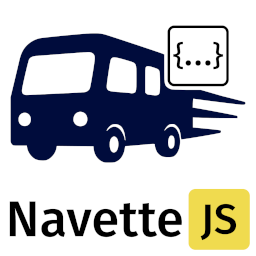

# NavetteJS



**The Lightweight Frontend Event Bus**

NavetteJS provides a lightweight event bus system
for your frontends and microfrontends.

It has no dependencies and is easy to integrate
with tools like RxJS or React hooks.

Under the hood, NavetteJS uses HTML CustomEvents
for communication, enabling multiple versions
to coexist without conflict. It simplifies 
communication between microfrontends
without requiring the same version to be deployed 
across all of them.

## Setup

In your frontend or microfrontend, install it:

```sh
npm install @navettejs/navettejs
```

Then, create one instance of `TopicManager` as a
global variable or singleton (if you have a DI
container).

This class provides all the methods to create/use
topics.

```ts
import { TopicsManager } from '@navettejs/navettejs';

const manager = new TopicsManager();
```

## Usage

### Event Topics

Event topics deliver emitted values to all current subscribers at the time of emission.
New subscribers won't receive any previously emitted values.

Topics must have a unique id, it allows multiple microfrontends to share the same topic by name.

```ts
import { Subscriber, TopicMode } from '@navettejs/navettejs';

interface MyData {
  foo: string;
  bar: number;
}

const topic = manager.topic<MyData>({
  id: 'unique_id',
  mode: TopicMode.EVENT
});

topic.emit({ foo: '1', bar: 1 });

const subscriber: Subscriber = {
  on: (data: MyData) => {
    // Logs to console as '<data.foo>:<data.bar>'
    console.log(data.foo + ':' + data.bar);
  }
};

topic.subscribe(subscriber);

topic.emit({ foo: '2', bar: 2 });
// console.log -> '2:2'

topic.emit({ foo: '3', bar: 3 });
// console.log -> '3:3'
```

### Replay Topics

Replay topics behave like event topics, except that new subscribers
immediately receive the last emitted value upon subscription.

Useful kind of topic to store a state, like an access token or a user id.

```ts
import { Subscriber, TopicMode } from '@navettejs/navettejs';

interface MyData {
  foo: string;
  bar: number;
}

const topic = manager.topic<MyData>({
  id: 'unique_id',
  mode: TopicMode.REPLAY
});

topic.emit({ foo: '1', bar: 1 });
topic.emit({ foo: '2', bar: 2 });

const subscriber: Subscriber = {
  on: (data: MyData) => {
    // Logs to console as '<data.foo>:<data.bar>'
    console.log(data.foo + ':' + data.bar);
  }
};

topic.subscribe(subscriber);
// console.log -> '2:2' (latest value before subscription.)

topic.emit({ foo: '3', bar: 3 });
// console.log -> '3:3'

topic.emit({ foo: '4', bar: 4 });
// console.log -> '4:4'
```

## Unsubscribe

You may unsubscribe a subscriber to stop receiving values.
It will also prevent memory leaks if your microfrontend is about to stop.

```ts
import { Subscriber, TopicMode } from '@navettejs/navettejs';

interface MyData {
  foo: string;
  bar: number;
}

const topic = manager.topic<MyData>({
  id: 'unique_id',
  mode: TopicMode.EVENT
});

const subscriber: Subscriber = {
  on: (data: MyData) => {
    // Logs to console as '<data.foo>:<data.bar>'
    console.log(data.foo + ':' + data.bar);
  }
};

topic.subscribe(subscriber);

topic.emit({ foo: '1', bar: 1 });
// console.log -> '1:1'

topic.unsubscribe(subscriber);

topic.emit({ foo: '1', bar: 1 });
// nothing happens.
```
